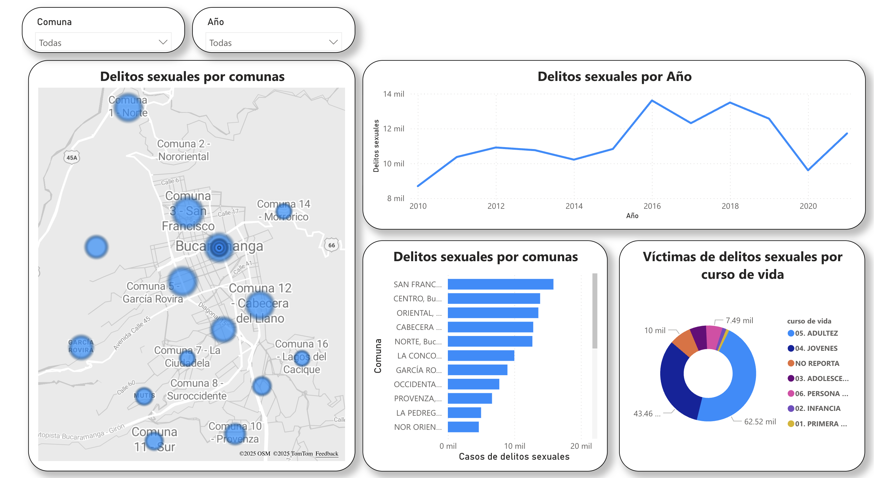
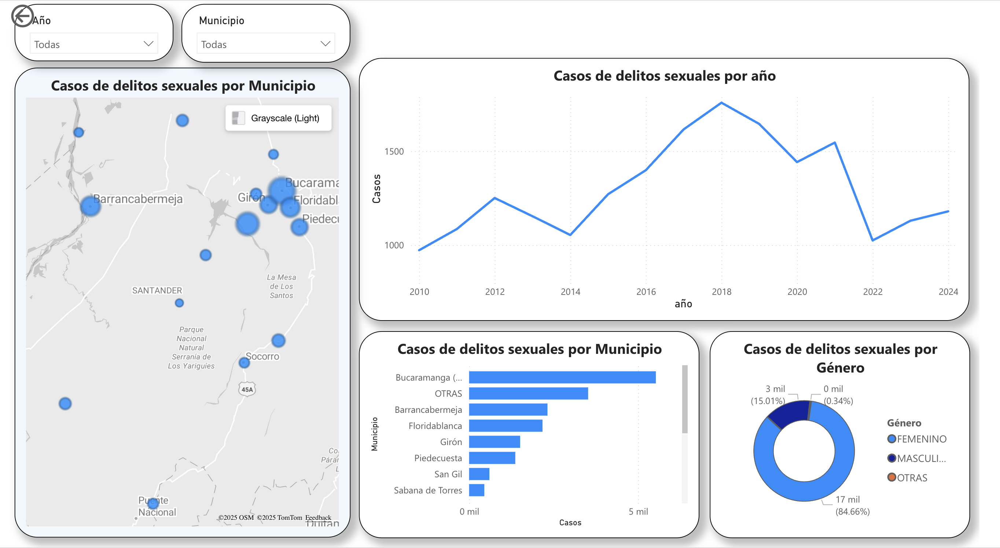

# Public Safety Analytics Dashboard – Santander

## 📊 Overview

Interactive Power BI dashboard developed to analyze 330,000+ crime records (2010–2025) in Santander, Colombia.

The solution transforms public safety data into actionable insights through trend analysis, geospatial visualization, and executive KPI monitoring.

## 🏆 Recognition

Ranked 4th place in the “Datos Abiertos” competition (Advanced Category), organized by the Ministry of Information and Communication Technologies of Colombia (MinTIC).

The competition evaluated data-driven solutions focused on public sector impact and analytical rigor.

## 🎯 Business Objective

Support data-driven decision-making by enabling:
	•	Identification of high-crime municipalities
	•	Temporal trend analysis (YoY & MoM variations)
	•	Hotspot detection through geospatial visualization
	•	Monitoring of key public safety indicators

## 🧠 My Contribution
	•	Designed complete star schema data model
	•	Built advanced DAX measures and time intelligence metrics
	•	Developed interactive dashboards with drill-through capabilities
	•	Implemented geospatial analysis (heatmaps & clustering)
	•	Created executive-level KPI reporting layout

## 🛠️ Skills Demonstrated
	•	Data Modeling (Star Schema)
	•	Advanced DAX
	•	Time Intelligence
	•	KPI & Metric Design
	•	Geospatial Visualization
	•	Dashboard UX & Storytelling

## 📸 Dashboard Preview

### 🔹 Delitos sexuales en Bucaramanga

**Visualizar en Power BI:**  
https://app.powerbi.com/view?r=eyJrIjoiNjc0ZWYyZTMtOTM0ZC00Y2RiLTk2NTgtZmNhNTE3MmZkMzBkIiwidCI6IjU3N2ZjMWQ4LTA5MjItNDU4ZS04N2JmLWVjNGY0NTVlYjYwMCIsImMiOjR9

---

### 🔹 Delitos sexuales en Santander

**Visualizar en Power BI:**  
https://app.powerbi.com/view?r=eyJrIjoiMzRmNDg1NDAtY2ZmOS00OGE2LTk5MTctOGU2NDk3OWZjZjM2IiwidCI6IjU3N2ZjMWQ4LTA5MjItNDU4ZS04N2JmLWVjNGY0NTVlYjYwMCIsImMiOjR9

⸻

